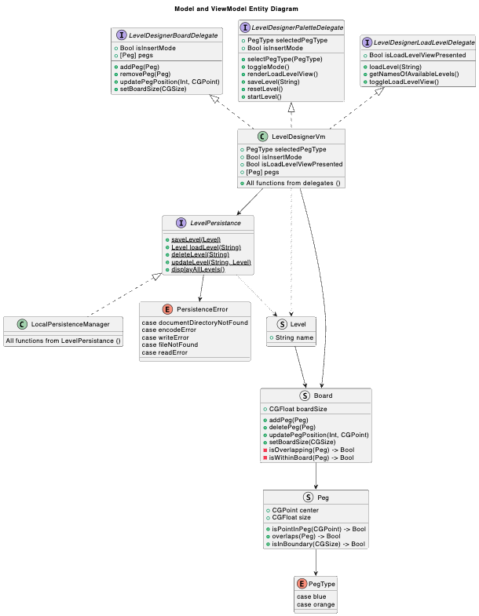
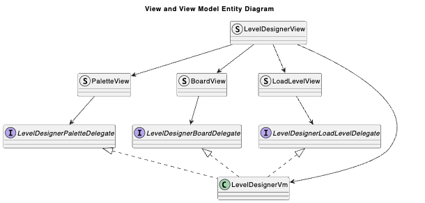
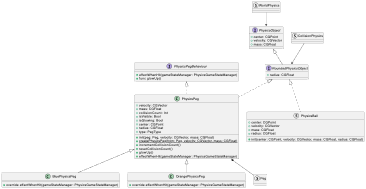
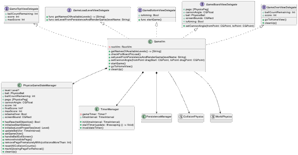
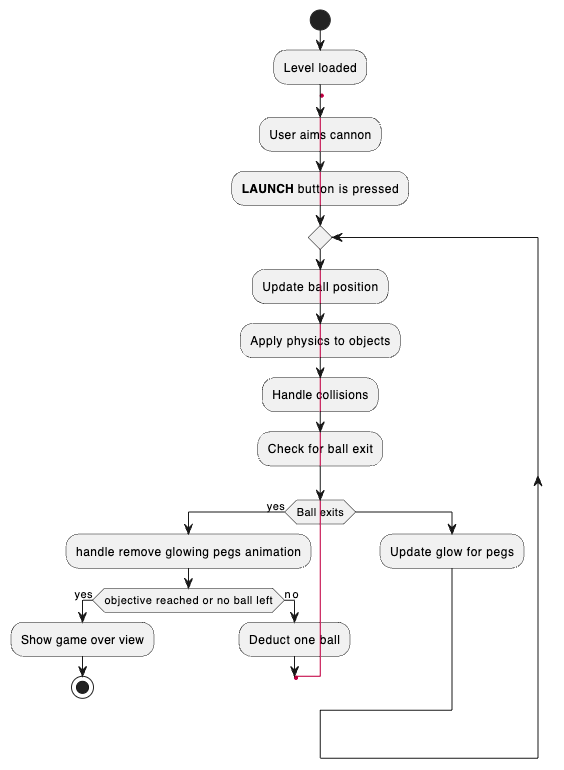

# Developer Guide
- Protocol oriented programming is used for powers and peg. Thus all powers have the `effectWhenActivated(GameStateManager)` function, which can then apply their effect. Similarly, pegs have the GameStateManager `effectWhenActivated(GameStateManager)` function.
- `Peg` and `Obstacle` are subclasses of `BoardObject`, which can be played on a board. Likewise, `GamePeg` and `GameObstacle` are subclasses of `GameObjects`. Inheritance is used to create different game pegs (eg. ExplodingGamePeg inherits from GamePeg). On the other hand, composition is used to create different obstacle shapes (I was thinking that it might be possible for us to extend it the future such that obstacles can have changing shapes, changing peg types seem more unlikely on the other hand).

# Design
This app uses the MVVM architecture, generally following this [variation](https://matteomanferdini.com/mvvm-swiftui/). Anything below here are mainly from ps2 and ps3, with slight modification.

### Views

We want Views to be as loosely coupled as possible. However, there are certain views that will instantiate the view model. We call these type of views "root views". Generally, each screen will have one "root view". For example, the home screen will have its own root view, which contains the home view model; The level designer will have its own root view, which contains one instance of the level designer view model.

The root view will consist of multiple views that make up the screen, which has to deal with user interaction. For example, the `LevelDesignerView` can be made out of a `BoardView`, for users to put the pegs, and an `PaletteView`, for users to select peg type, undo etc. These views will receive an instance of view model from the root view, instead of maintaining their own. Furthermore, these views use the Delegate design pattern so even though they receive the instance of view model, only functions and variables that are relevant are exposed to the views.

The last type of views are the least coupled ones. They deal solely with UI and do not deal with user Interaction at all. This includes the `PegView` (which sole purpose is to render the Peg Image), and `UndoButton`.

The root view of the different screens and the screen specific views will be put in their subfolders respectively. Eg. `LevelDesignerView`, `BoardView` and `PaletteView` will be put under Views/LevelDesigner/ since they all collectively make up the level designer.  
The last type would be put under Views/ReusableComponents. Even though `PegView` can also be found in the level designer, it is not specific to level designer since it does not require any level designer view model to handle level designer specific logic. It is independent of business logic and view models and thus is considered reusable.

### Models

We organize the models into their various folders. Protocols are self-explanatory. DataModels are models that actually represent the game entities rather than business logic. Thus models like `Peg` and `Level` belongs here. Utilities are models that handle business logic rather than game entities, housing models like `PersistenceManager` which deals with persistence, and `Constants`, which houses the different default configurations of the app.

### ViewModels

This folder houses all the view models. Generally, each view model will correspond to one screen.

## Design Philosophy

Here is a entity diagram for the models and view models:

- `I`: Interface, or protocol in swift
- `C`: Class
- `E`: Enum
- `S`: Struct

This is the from ps2.
### View and View Models

The view model is the "brain" of the program. It handles translates user actions from the View to logic. It uses the Observable pattern through SwiftUI's inbuilt `Observable` annotation. The root view will "listen" to the view model for changes, and any changes in the variables stored in the view model will notify the view to update.  
Since each view model is in charge of one screen, and each screen is made out of smaller views (think `BoardView` and `PaletteView` in the `LevelDesigner` screen), the view model needs to provide functionalities for these views to interact with. Thus, it has to conform to the delegates of the views under its belt.  
For instance, now that `LevelDesignerVm` conforms to `LevelDesignerPaletteDelegate`, we can be sure that the `selectPegType` function is available in the `PaletteView` when the user selects between the blue and orange peg.  
Another benefit that comes with the Delegate pattern is that we ensure that **only** the functions required in the particular view are being exposed. For example, the `PaletteView` will not have access to the `removePeg` function of the view model, and rightfully so since it is not needed in the `PaletteView`. This prevents unexpected mutation and enforces the single responsibility principle.

### View Model and Models

The view model store and interacts with the models, and views have no direct interaction with the models. For instance, the `LevelDesignerVm` contains a `Board` model. So when pegs are added in the `BoardView`, instead of calling the `addPeg` function of `Board`, the `BoardView` will call the `addPeg` function of `LevelDesignerVm`. Internally, the `LevelDesignerVm` will then call the `addPeg` function of `Board`.  
Another example is how instead of directly storing the pegs, the `BoardView` would request the `LevelDesignerVm` for the pegs, and the View's jobs is to render the pegs.

### Persistence

The `LocalPersistenceManager` is a utility model that deals with persistence. It conforms to `LevelPersistence`, which ensures that it has the necessary functions to handle level persistence like saving levels and loading levels.  
Since `LevelDesignerVm` contains a `LevelPersistence`, we can be sure that functions like `saveLevel` will be available. The implementation details will not be exposed. Currently, we are setting `LocalPersistenceManager` as the default manager which uses JSON for persistence, but we could image that in the future, it is possible to easily swap it with something like `SqlitePersistenceManager` or something, as long as it conforms to `LevelPersistence`. This makes the code extremely modular and not dependant on one particular implementation.

### Other Models

- The `Board` model is an abstraction over the area where the pegs are placed, and contains functions that are relevant to its job scope.
- The `Peg` model is an abstraction over the peg, which contains a `PegType` enum that is easily extendable.
- The `Level` model is an abstraction over the `Board` that is to be saved and loaded. It's basically a `Board`, except it should be identifiable (with a name) since it needs to be saved and loaded.
- The `Validator` is self explanatory. Currently it's function is to check whether the input is valid

### Views

- `ContentView`: The main view of the app. It has no view model as it's purpose is to segment the screens
- `LevelDesignerView`: The root view of the level designer screen. It contains the instance of the view modal, it is a high level view that encapsulates other views that make up the level designer. Thus it will pass the view modal to its child views.
  - `PaletteView`: The view that allows users to be able to select peg types, do actions like `SAVE`, `LOAD` etc.
    - Within the view, it can be further segmented into `PegSelectionView` which consists of the Peg type buttons and the undo button, and `ActionButtonsView` which consists of the `SAVE`, `LOAD`, `RESET`, `START` and text input for level name.
  - `BoardView`: The "canvas" for the pegs to be placed
    - Within the view, it can be further segmented into the `PegInteractiveView` to render the pegs, and `InvisibleLayerView` to capture the taps
  - `LoadLevelView`: The modal popup that shows all the available level when user clicks on the `LOAD` button

# Design
Game related files from ps2 is under the `Game` folder, Physics Engine related files are under the `PhysicsEngine` folder.

## Root View Model

I have created a root view model to pass data between view models. Every other view models will be instantiated with a reference to the root view model, and if they want to interact with other view models, they can call the root view model functions. For instance, the home view requires navigation the the level designer view when the level designer button is pressed, and to the game view when the game button is pressed.  
The delegate pattern is also used to ensure that only the functions needed are exposed to the individual view models.

## Views
Like the previous problem set, the views will contain a reference to its view model through the delegate of each views. This makes sure that only the relevant functions and variables are being exposed to the views.

## Physics Objects

Physics objects are objects that can be handled by the physics engine, and they contain basic physics properties such as mass, velocity. For extension, new physics object protocols that conforms to `PhysicsObject` can be created. For instance, `RoundedPhysicsObject` has all the properties of `PhysicsObject`, with an additional `radius` property. A `RectangularPhysicsObject` could perhaps have additional width and height property.

## Physics Engine
`PhysicsObject` conforms to `CollisionPhysicsBehaviour` and `WorldPhysicsBehaviour`. Generally, world physics behaviour is generalisable across different physics shape, such as applying force or gravity. The shape does not matter much. For `CollisionPhysicsBehaviour`, the different subclasses (eg. RoundPhysicsObject) will override the parent class when implementing the different functions to handle collisions.

## Turning Models to Game Objects

Note that the diagram is outdated due to refactoring. Instead of directly modifying the `Peg` and `Ball` models, we create another layer of abstraction - `GamePeg` and `GameBall`. This is because the `Peg` and `Ball` should be decoupled from the game as much as possible, and their main responsibility is to store simple data. The game engine will be responsible for this conversion before the game starts. The physics states only matter for the duration of the game itself. For the `GamePeg`, a factory method is used to create a different `GamePeg` based on the peg type. For example, passing in a blue peg will create a `BlueGamePeg`, while passing in an orange peg will create an `OrangeGamePeg`.  
Both `BlueGamePeg` and `OrangeGamePeg` inherits from `GamePeg`, which conforms to `PegBehaviour`. The `PegBehaviour` requires the `GamePeg` to have a certain behaviour when being collided with, by taking in a game state manager and modifying the game state. The `BlueGamePeg` and `OrangeGamePeg` can then override the parent behaviour to implement their own behaviours. For instance, the `OrangeGamePeg` will add a score in the game state while `BlueGamePeg` will not.

### Game Engine

Image is outdated due to refactoring.
The game engine is basically the game view model in this case. It's responsibility is to - convert the models that game entities (GameObjects), manage the game loop and states.  
To improve readability, I have created a `GameStateManager` and a `TimerManager` that help separate some responsibilities from the game engine. The `GameStateManager` manages the game states like pegs remaining, ball count, score etc. while the `TimerManager` abstracts away the implementation details of the game loop, exposing just the necessary functions like `startTimer` and `invalidateTimer` to the game engine.

### Lifecycle of a game

When the game view is first rendered, it will check if there is a specific level to load (eg. if you press `START` from the level designer you want to load that into the game directly).

1. There is a specific level to load. In that case, we move straight to the next step
2. There is no specific level to load. We then render the load level view for the user to choose, then proceed with the next step

(Sorry for the formatting, deduct one ball lead to `User aims cannon`) .
Once the level is loaded, the user will be able to aim their cannon by dragging on the screen. When the `LAUNCH` button is pressed, the game engine will ask `TimerManager` to start the loop.

When the loop is active, it will call the `updateGameState` function repeatedly, the count depends on the FPS set (current default is 60 FPS, which means the function will be called 60 times every second).

The responsibility of the `updateGameState` function is to update the states (positions. glow etc.), apply physics to the objects, check for actionable changes (eg. ball exits screen). The loop will continue until an actionable change is detected, in which case the game loop will be terminated and the actionable change will be handled accordingly.

When the ball exits the screen, this is detected in the game loop, which will trigger the animation for peg removal. After the animation is done, it will either:

1. End the game and render the game over view
2. Continue the game, player goes back to the aiming stage with the `LAUNCH` button.

